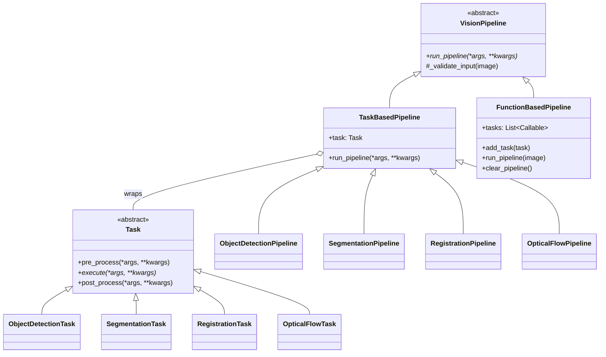

# Architecture

This document explains how VisionPipelines is organized and how to extend it. For usage examples, see the [README](../README.md) and the [notebooks](../notebooks/).

## Core idea

The library is built from two kinds of objects:

- A **Task** performs one computer-vision operation (detect objects, segment an image, register two images, ...). It splits the work into three steps: `pre_process` → `execute` → `post_process`.
- A **Pipeline** is the user-facing entry point. It wraps a task, runs its three steps, and adds convenience helpers such as drawing boxes or warping images.

Each task picks its algorithm through a **method enum** (e.g. `DetectionMethod.FASTER_RCNN`), so switching algorithms never changes the calling code.

## Project layout

```
src/visionpipelines/
├── __init__.py              # public API: pipelines, enums, result types
├── constants.py             # method enums (DetectionMethod, SegmentationMethod, ...)
├── utils.py                 # small callables for FunctionBasedPipeline (resize, to_grayscale)
├── tasks/
│   ├── task.py              # Task abstract base class
│   ├── object_detection_task.py
│   ├── segmentation_task.py
│   ├── registration_task.py # also defines RegistrationResult
│   └── optical_flow_task.py
└── pipelines/
    ├── vision_pipeline.py   # VisionPipeline, TaskBasedPipeline, FunctionBasedPipeline
    ├── object_detection_pipeline.py
    ├── segmentation_pipeline.py
    ├── registration_pipeline.py
    └── optical_flow_pipeline.py

tests/
├── tasks/                   # one test module per task
├── pipelines/               # one test module per pipeline, plus the base classes
└── data/                    # small sample images

notebooks/                   # one walkthrough notebook per task
```

## Class hierarchy



### `Task` ([tasks/task.py](../src/visionpipelines/tasks/task.py))

Abstract base class for a single operation.

| Method | Required | Default behaviour |
|---|---|---|
| `execute(*args, **kwargs)` | yes (abstract) | — |
| `pre_process(*args, **kwargs)` | no | returns its inputs unchanged |
| `post_process(*args, **kwargs)` | no | returns its inputs unchanged |

Tasks can be used on their own, without a pipeline, which is how most unit tests exercise them.

### `VisionPipeline` ([pipelines/vision_pipeline.py](../src/visionpipelines/pipelines/vision_pipeline.py))

Abstract base class for all pipelines. It declares `run_pipeline` and provides `_validate_input`, which rejects `None`, non-numpy and empty images.

### `TaskBasedPipeline`

Runs a single `Task` through its three steps. It passes values between steps with one rule:

- if a step returns a **tuple**, it is unpacked into positional arguments for the next step;
- anything else (an array, a dataclass, a list) is passed as a **single argument**.

```
run_pipeline(*args, **kwargs)
  └─ pre_process(*args, **kwargs)        -> x
  └─ execute(*x, **kwargs)  if x is a tuple, else execute(x, **kwargs)        -> y
  └─ post_process(*y, **kwargs) if y is a tuple, else post_process(y, **kwargs)
```

So a task that needs several values in the next step returns a tuple, and a task that returns a structured result (such as `RegistrationResult`) is not unpacked. Note that `**kwargs` are forwarded to **all three** steps, so every step must accept any keyword argument passed to `run_pipeline`.

### `FunctionBasedPipeline`

A lightweight alternative for simple transformations: it chains plain callables (`add_task(fn)`) and applies them in order. The helpers in [utils.py](../src/visionpipelines/utils.py) return such callables.

### Concrete pipelines

Each concrete pipeline:

1. builds its task in `__init__` from a method enum and optional `model` / `device`,
2. passes it to `TaskBasedPipeline.__init__`,
3. overrides `run_pipeline` only to document the concrete signature and return type,
4. adds user-facing helpers that delegate to the task.

## Tasks at a glance

| Pipeline | Methods | Input | Output | Helpers |
|---|---|---|---|---|
| `ObjectDetectionPipeline` | `FASTER_RCNN`, `SSD` (torchvision), `YOLO` (ultralytics, optional extra) | image | `(boxes, labels, scores)` | `draw_boxes` |
| `SegmentationPipeline` | `DEEPLABV3`, `FCN` (torchvision) | image | class-index mask `(H, W)` | `overlay_mask` |
| `RegistrationPipeline` | `ORB`, `SIFT` (OpenCV) | reference, moving image | `RegistrationResult` | `plot_matches` |
| `OpticalFlowPipeline` | `FARNEBACK` (OpenCV), `RAFT_SMALL`, `RAFT_LARGE` (torchvision) | two frames | flow `(H, W, 2)` | `warp`, `flow_to_color` |

## Conventions

- **Images in:** numpy arrays in OpenCV layout, i.e. BGR `(H, W, 3)` or grayscale `(H, W)`, `uint8`. Tasks convert to whatever their model needs.
- **Outputs:** numpy arrays or dataclasses, never framework-specific tensors, so callers don't need to know which backend a method uses.
- **Models:** deep-learning tasks accept an optional `model` (default: pretrained weights for the chosen method) and `device` (default: CUDA if available, else CPU), and call `model.eval()` once at construction.
- **Label names:** tasks with classes expose `self.categories`, taken from the model's own weights metadata, so label indices always match the model.
- **Optional dependencies:** heavy or restrictively licensed backends (currently `ultralytics`, AGPL-3.0) are declared as optional extras in `pyproject.toml` and imported lazily inside the task, with an `ImportError` that says how to install them.
- **Errors:** invalid methods or unusable inputs raise `ValueError` with a message that says what went wrong and, where possible, how to fix it.

## Adding a new task

Using a hypothetical depth-estimation task as an example:

1. **Method enum:** add `DepthMethod` to [constants.py](../src/visionpipelines/constants.py).
2. **Task:** create `tasks/depth_task.py` with a `DepthTask(Task)` that implements `execute` (and `pre_process` / `post_process` if useful). Follow the conventions above for inputs, outputs, `model` and `device`.
3. **Pipeline:** create `pipelines/depth_pipeline.py` with a `DepthPipeline(TaskBasedPipeline)` that builds the task, documents `run_pipeline`, and exposes visualization helpers.
4. **Exports:** add the task to `tasks/__init__.py`, the pipeline to `pipelines/__init__.py`, and the pipeline, enum and any result type to the package `__init__.py` and its `__all__`.
5. **Dependencies:** if the task needs a new package, add it to `pyproject.toml` (as an optional extra if it is heavy or not Apache-compatible) and run `uv lock`.
6. **Tests:** add `tests/tasks/test_depth_task.py` and `tests/pipelines/test_depth_pipeline.py`. Prefer inputs with a known answer (e.g. a synthetic shift) over checking only output shapes.
7. **Docs:** add a quickstart snippet to the README, a row to the table above, and a `notebooks/depth.ipynb` walkthrough.

## Known inconsistencies

These are current quirks of the codebase, listed so they are not mistaken for conventions to copy:

1. **Object detection skips the shared step sequence.** `ObjectDetectionPipeline.run_pipeline` calls `pre_process`, `execute` and `post_process` itself, because `threshold` must reach `post_process` only, and `TaskBasedPipeline` forwards keyword arguments to every step.
2. **The three steps are used unevenly.** Detection and segmentation split their work across `pre_process` / `execute` / `post_process`. Registration and optical flow do everything in `execute` and rely on the default pass-through steps.
3. **Task aliases have different names.** Besides `.task`, each pipeline exposes the same object under its own name: `detector`, `segmenter`, `registrator`, `estimator`.
4. **`SegmentationTask` keeps state between steps.** It stores the input size on `self` in `pre_process` and reads it in `post_process`, so one instance must not process several images concurrently.
5. **`FunctionBasedPipeline` input type mismatch.** `_validate_input` only accepts numpy arrays, while the `utils.py` helpers expect torch tensors.
6. **Unused code.** The `TaskType` enum is not used anywhere, and `VisionPipeline._initialized` is set but never read.
7. **Output types differ.** Registration returns a dataclass (`RegistrationResult`), while the other pipelines return tuples or bare arrays.
